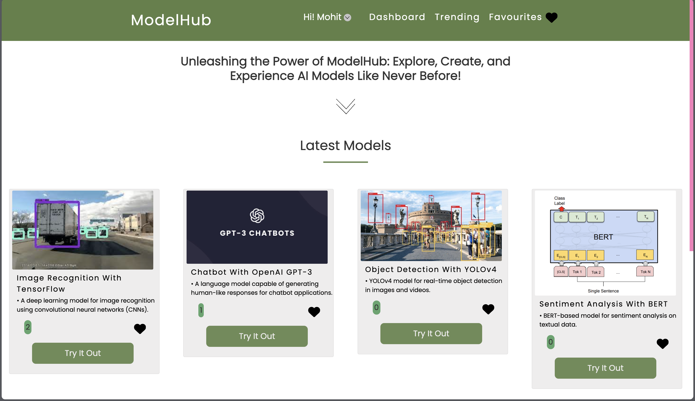
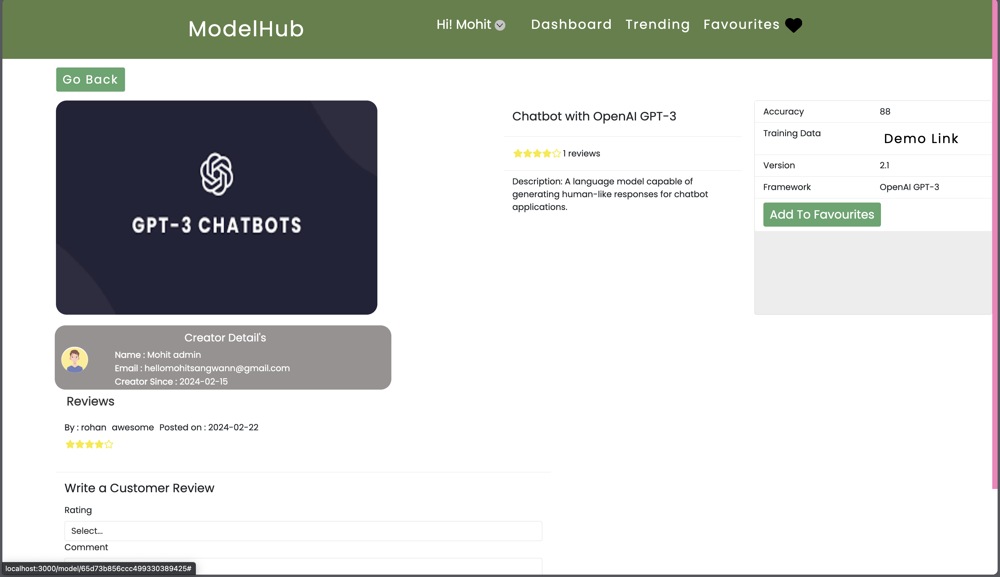
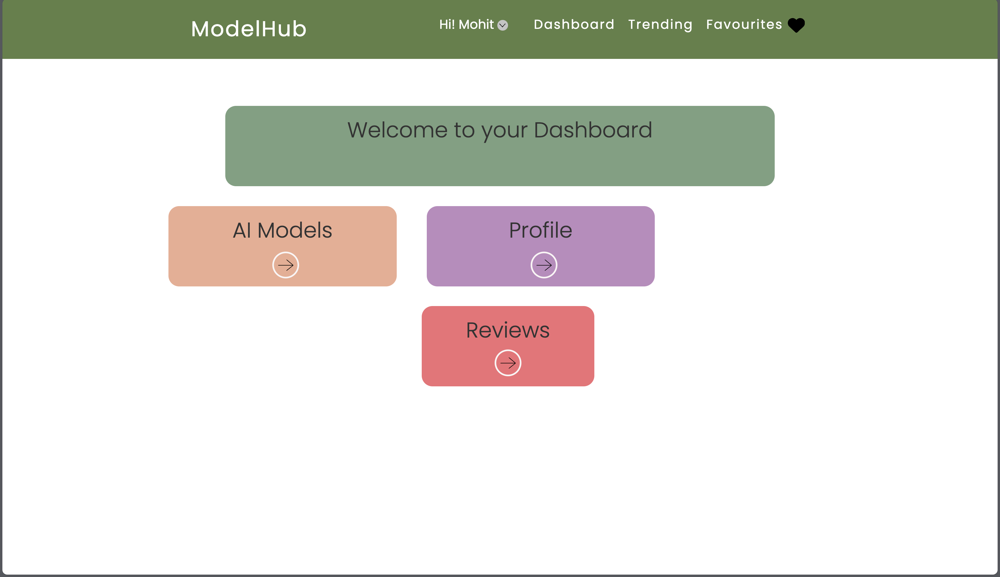
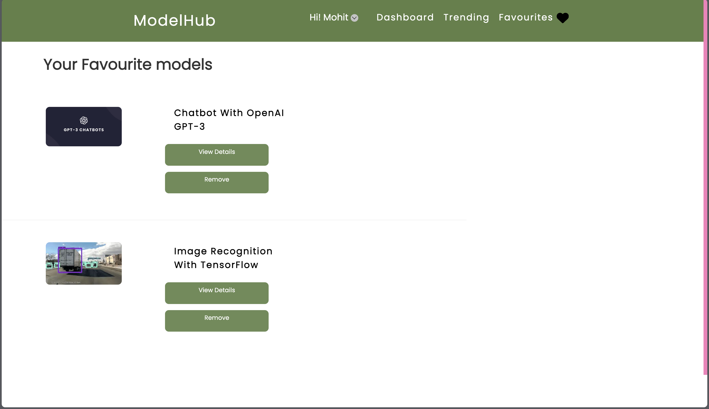
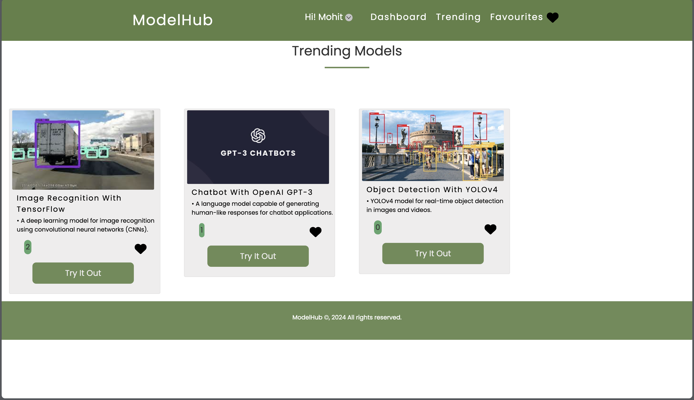
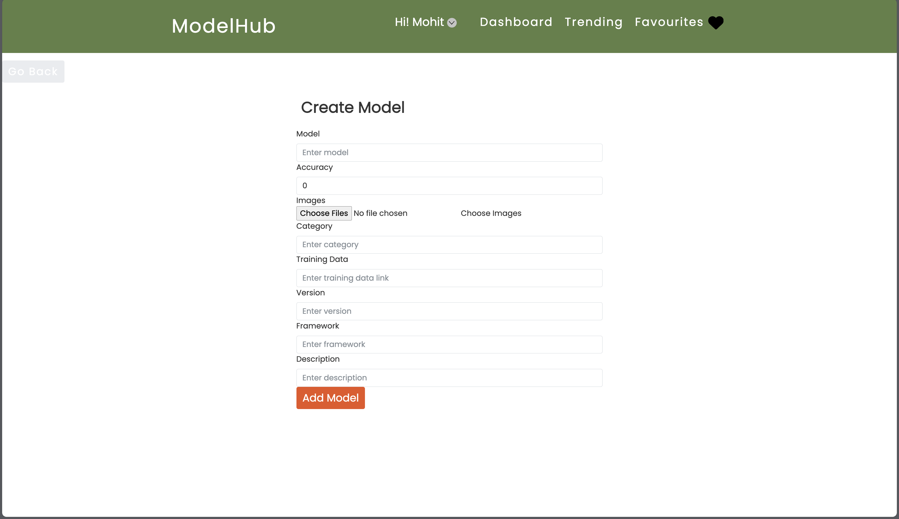
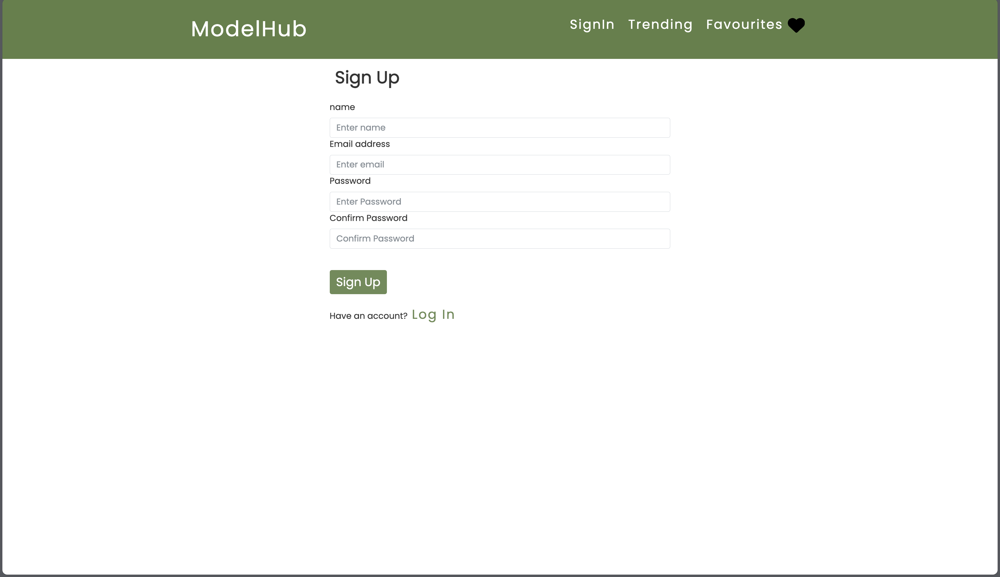

# ModelHub

ModelHub is an application that allows users to explore and discover various AI models deployed by organizations and developers. It provides an interface to showcase different models, their categories, and allows users to dive deeper into specific models.

## Table of Contents
- [Features](#features)
- [Screenshots](#screenshots)
- [Demo](#demo)
- [Getting Started](#getting-started)
- [Usage](#usage)
- [API](#api)
- [Contributing](#contributing)
- [License](#license)


## Features

- **Browsing Models:** Browse and discover various AI models available on the platform.
- **Featured Models Wall:** Highlight models that receive special attention or have high engagement.
- **Model Details:** Dive deeper into specific models with detailed information, accuracy, etc.
- **Create and Delete Models:** Creators can upload, delete information about their models seamlessly.
- **Creator Registration:** Create an account on our website using ouw inhouse JWT user authentication 
- **Reviews Feature:** Users can leave reviews for models and view reviews from other users.

- **Add to favourites Feature:** Users can add products to their favourites for future reference or purchase.


### Live link: [ModelHub](https://modelhub08.netlify.app)

# Screenshots:


### Home page


### AI Model Details Page


###  Dashboard


### Favourite Models Page


### Trending models page


### Create Model Page for creators


### Register Page



## Tech Stack

- **Frontend:** Built with ReactJS and hosted on Netlify, providing a smooth and responsive user interface.

- **Backend:** Powered by NodeJS and Express, with MongoDB as the database for efficient data storage.

- **Media Storage:** Images for products are stored on Cloudinary.

- **Authentication:** JWT (JSON Web Tokens) are used for secure user authentication, ensuring a safe and seamless login process.

- **Design:** Figma was utilized for the design process, ensuring a visually appealing and user-friendly interface.


## Getting Started

1. Clone the repository:

   ```bash
   git clone https://github.com/hellomohitsangwan/AI-Model-Explorer

2. Install dependencies:
   ```bash
    cd procommerce/client
    npm install
    cd ../serve
    npm install

3. Start the application:
   ```bash
    # Start webapp
    npm run dev


4. Visit http://localhost:3000 to access the ProCommerce application.